# onkyori_common
onkyori_*** are modules what enable cooperation with the Onkyo RI system.  

## Description
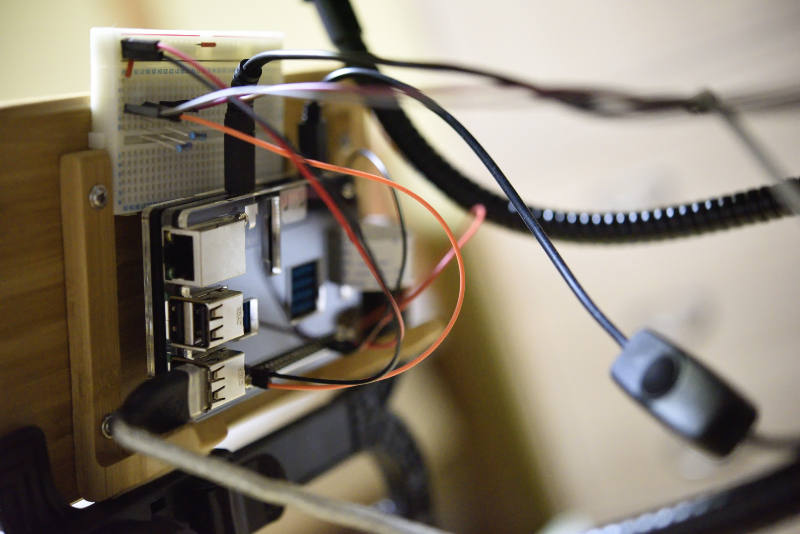

The onkyori_common is the core module in order to cooperate with the Onkyo RI system.  
This includes the MariaDB database definision file, and the common settings file.  
If you combine this with other onkyori_*** modules (example. onkyori_kiosk), you will have new experiences.  

## Requirement
- Raspberry Pi 3 Type B
    - OS: Raspbian
    - Linux kernel: 4.14.41
    - Linux Packages:
        - MariaDB database 10.1.23
    - Python Packages:
        - PyMySQL 0.8.0
        - PyYAML 3.12

## Install
1. Place this repository files into your Raspberry Pi
    1. Login to Raspberry Pi.  
    1. Create directory: '/var/project/onkyori_common/'  
    1. Place this repository files to '/var/project/onkyori_common/'
1. Setup database
    1. Login to MariaDB.
    1. Create user and database what are written in 'settings.yaml'.  
       The created user is allowed to access the created database only.  
    1. Select the created database.
    1. Run 'CreateDBTable.sql' to create the table.

## Onkyo RI Signal Specification
- Equipment: Onkyo FR-T1X
- Pulse width: 1.0ms
- Voltage: 5.3V
- Actual Data
    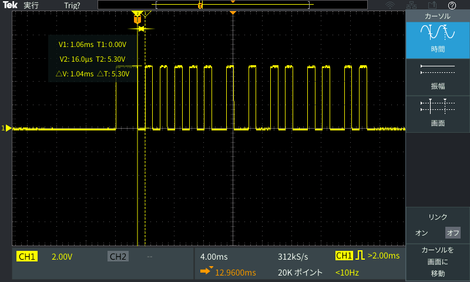
    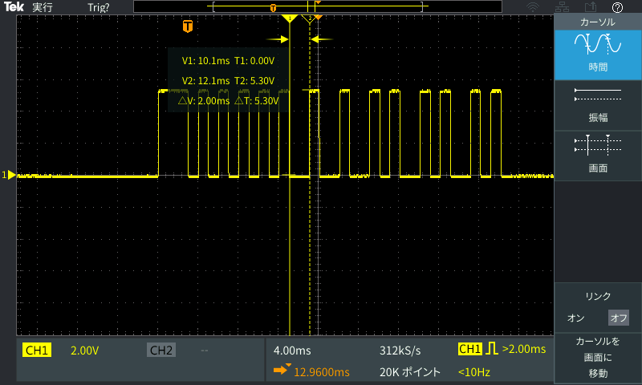
    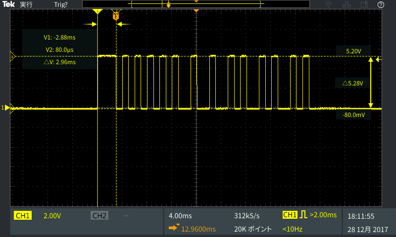
- Various Signals
    - Power On
        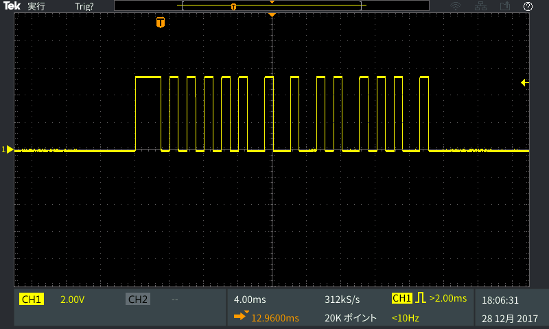
    - Power Off
        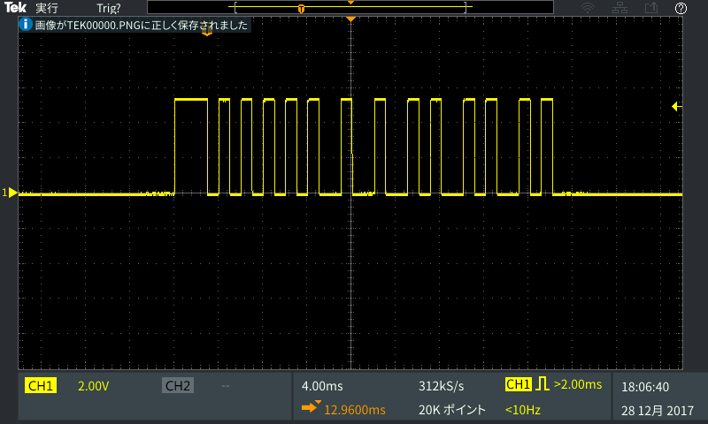
    - Tape (Prev)
        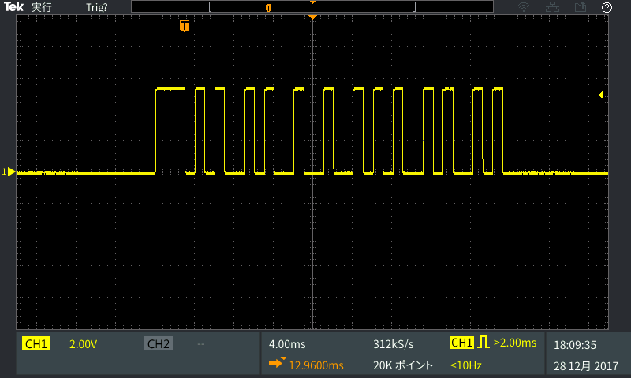
    - Tape (Stop)
        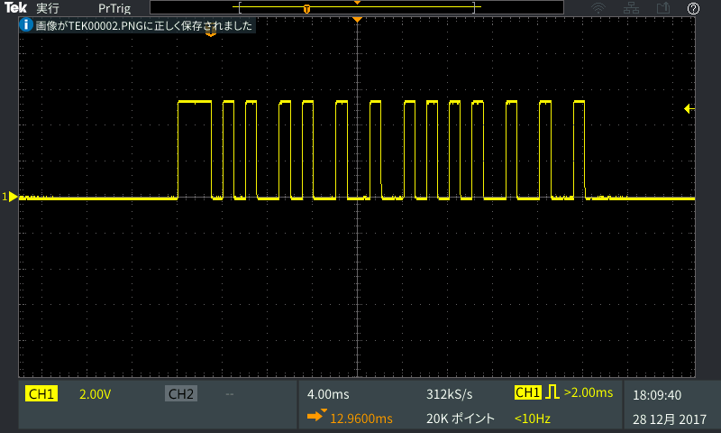
    - Tape (Next)
        
    - Playlist (Up)
        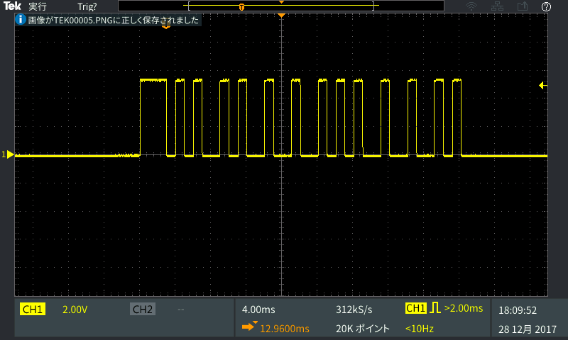
    - Playlist (Down)
        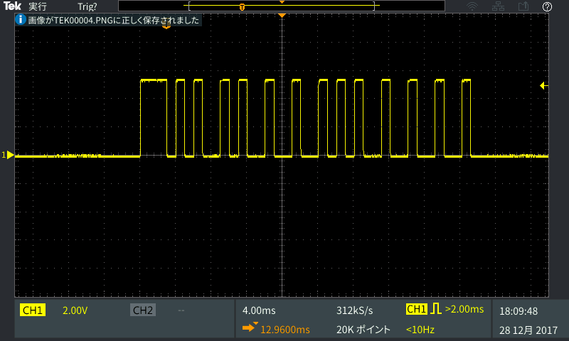
    - Album (Up)
        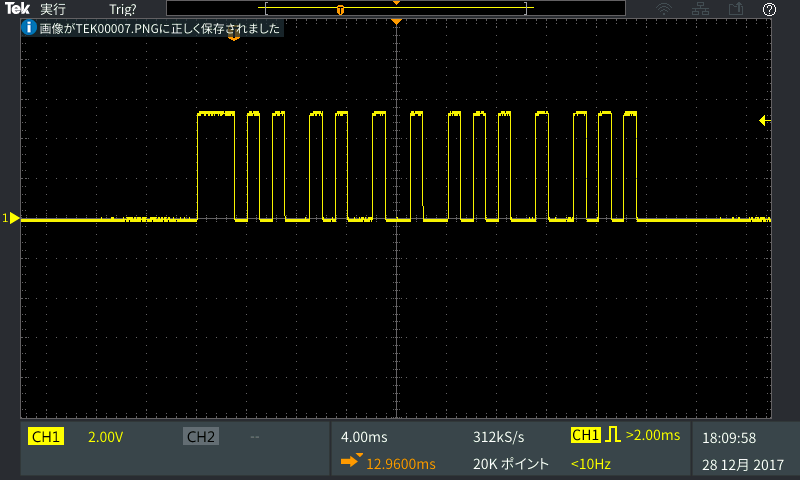
    - Album (Down)
        

## Licence
[GNU General Public License v3.0](https://github.com/jun10000/onkyori_common/blob/master/LICENSE)

## Author
[jun10000](https://github.com/jun10000)
